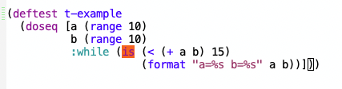
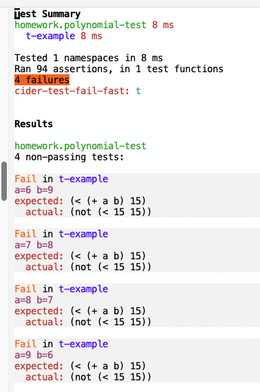

# Clojure implementation of [HeavyBool](../README.md)


## Documentation
  - [API](API.md)
  - [examples](API-examples.md)

## Motivation

Here is an example.  Consider the following test case which uses the `clojure.test` API.

```
(deftest t-plus-associative
  ;; check associativity
  (doseq [p1 polynomials
          p2 polynomials
          p3 polynomials]
    (is (sut/==
           (sut/+ (sut/+ p1 p2) p3)
           (sut/+ p1 (sut/+ p2 p3)))
        (format "Discovered non-associative input for +\np1=%s\np2=%sp3=%s"
                p1 p2 p3))))
```

The test tries to find an example (counter example) where the function `sut/+` fails
to be associative.  If such is found, the side-effecting call to `is` registers the counter example,
but the `doseq` loop continues.  Thus, if N is the length of `polynomials`, then worst case
the loop will report N-cubed many violations.

## `:while` First Vain Attempted Fix

The first attempt to fix this problem is to evoke the `:while` modifier.

```
(deftest t-plus-associative
  ;; check associativity
  (doseq [p1 polynomials
          p2 polynomials
          p3 polynomials
          :while (is (sut/==
                       (sut/+ (sut/+ p1 p2) p3)
                       (sut/+ p1 (sut/+ p2 p3)))
                     (format "Discovered non-associative input for +\np1=%s\np2=%sp3=%s"
                        p1 p2 p3))
         ]))
```

This attempt works somewhat, but `:while` does not exactly stop the iteration.
Instead, the `:while` modifier causes the inner most loop `p3` to exit,
evoking the next iteration of `p2`.  The computation
of success values of the expression continues for some time after the first
`false` value of `(is ...)`.   The end effect is that we'll have N-squared rather than N-cubed
many failures.

Here is a simpler example which shows that the `(doseq ... :while ....)` loop does
not abort on the first failure.






## `every?` Second Vain Attempted Fix

If we wish the test to simply fail on the first violation, we might be
tempted to rewrite the code as follows.

```
(deftest t-plus-associative-b
  ;; check associativity
  (is (every? (fn [p1]
                (every? (fn [p2]
                          (every? (fn [p3]
                                    (sut/==
                                       (sut/+
                                         (sut/+ p1 p2)
                                         p3)
                                       (sut/+
                                         p1
                                         (sut/+ p2 p3))))
                                  polynomials)) 
                        polynomials)) 
              polynomials)
      ;; regretably, p1, p2, and p3 are out of scope
      "WHAT TEXT TO PUT HERE?"))))
```

By pulling the `is` outside the loop, the test will fail early, as
soon as it discovers one failure.  However, there is no way to
construct the second argument of `is` which should indicate the values
of `p1`, `p2`, and `p3` which constitute the counterexample.


## `heavy-bool` As Fix

Using the `heavy-bool` library, we can write this test as follows:

```
(deftest t-plus-associative-b
  ;; check associativity
  (is (hb/+bool (hb/+forall [p1 polynomials
                             p2 polynomials
                             p3 polynomials]
                  (hb/+tag
                    (hb/+heavy-bool (sut/==
                                      (sut/+ (sut/+ p1 p1)
                                             p3)
                                      (sut/+ p1
                                             (sut/+ p2 p3))))
                    :associative)))))
```

If this test fails, we'll see a message such as the following.  Cryptic, but all the information is there.

The `:bar` and `:witness` tags of the error message indicates that when `p1 = {0 1}` and `p2 = {}` and `p3 = {0 1}` the associativity fails `:associative false`.

```
Fail in t-plus-associative-b
hb: plus associativity

expected: (hb/+bool
           (hb/+forall
            [p1 polynomials p2 polynomials p3 polynomials]
            (hb/+tag
             (hb/+heavy-bool
              (sut/==
               (sut/+ (sut/+ p1 p1) p3)
               (sut/+ p1 (sut/+ p2 p3))))
             :associative)))
  actual: (not          
           (hb/+bool
            [false
             ({:witness {0 1}, :var p1}
              {:witness {}, :var p2}
              {:witness {0 1}, :var p3}
              {:associative false})]))
```
